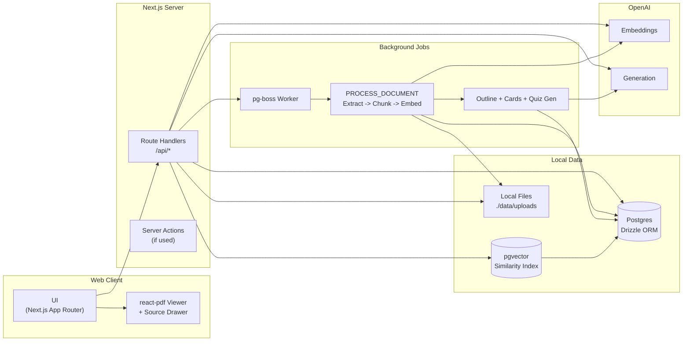

# StudyBuddy AI

A study workspace that turns PDFs into lessons, flashcards, quizzes, and daily 10-minute review sessions.
Everything stays grounded with page-level citations so students can trace every answer back to the source.

## Overview

StudyBuddy AI helps students:
- Upload PDFs and auto-generate structured outlines (modules, lessons, concepts).
- Create flashcards and quizzes with citations tied to pages and chunk ids.
- Run daily sessions using spaced repetition (SM-2).
- Track progress with charts and upcoming review forecasts.
- Search and ask questions with source citations.

## Usage

- Upload PDFs and track ingestion status.
- Generate outlines, cards, and quizzes from the course page.
- Review cards in daily focus sessions.
- Search and ask questions with cited sources.
- Share read-only course links and export flashcards to CSV.

## Architecture



## Tech Stack

- Frontend: Next.js (App Router), React, TypeScript, Tailwind CSS, shadcn/ui, lucide-react, Framer Motion, Recharts, react-pdf
- Backend: Next.js Route Handlers, Drizzle ORM, Zod
- Jobs: pg-boss (Postgres-backed queue)
- DB: PostgreSQL with pgvector extension
- Storage: local filesystem under `./data/uploads`
- AI: OpenAI embeddings + generation

## Environment Variables

Create a `.env` file:

```bash
DATABASE_URL=postgres://...
OPENAI_API_KEY=your_openai_key_here
OPENAI_MODEL=gpt-4o-mini
OPENAI_EMBED_MODEL=text-embedding-3-small
DATA_DIR=./data
```

## Local Setup (Brief)

1) Install dependencies
```bash
pnpm install
```

2) Ensure Postgres extensions exist
```sql
CREATE EXTENSION IF NOT EXISTS vector;
CREATE EXTENSION IF NOT EXISTS "uuid-ossp";
```

3) Run migrations
```bash
pnpm drizzle-kit migrate
```

4) Run the app and worker
```bash
pnpm dev
pnpm worker
```

## Key User Flows

- Upload: add a PDF and watch ingestion progress.
- Course: generate outline, view modules/lessons/concepts.
- Lesson: generate cards/quizzes, review with citations.
- Daily: run 10-minute sessions with SM-2 ratings.
- Progress: view due forecast, mastery ladder, and heatmaps.
- Search: semantic search + "ask my course" with citations.

## Scripts

- `pnpm dev` - start the Next.js app
- `pnpm worker` - start the pg-boss worker
- `pnpm lint` - lint the codebase
- `pnpm test` - run Vitest unit tests
- `pnpm e2e` - run Playwright e2e test

## Notes

- No Docker/AWS/Cloudflare; runs fully local.
- PDFs are stored at `./data/uploads/{documentId}.pdf`.
- OpenAI calls are retried with backoff for reliability.

---

**Last Updated:** March 1, 2026  
**Version:** 1.0.0
